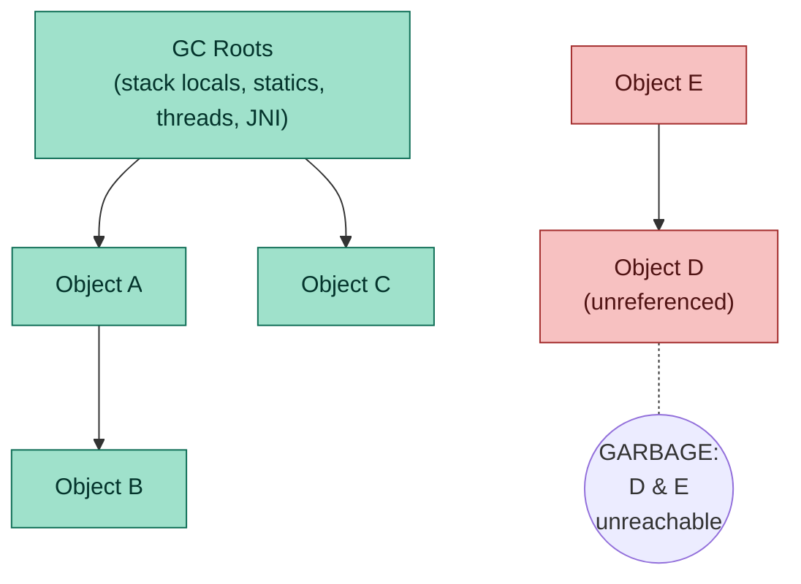
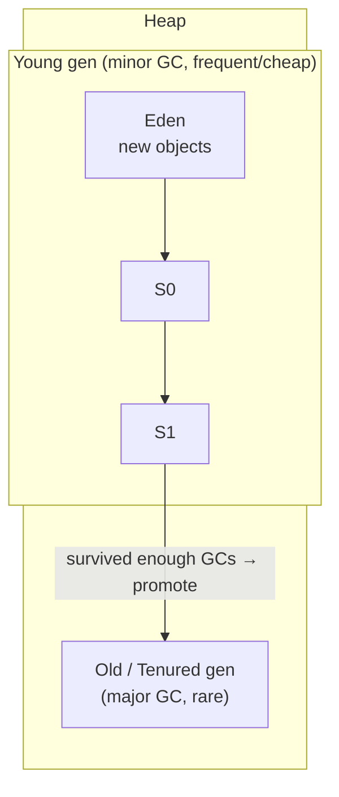
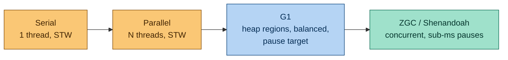

## TL;DR ⚡

> [!abstract] 5-second recall
>
> - GC decides garbage by **reachability**, NOT recency. Trace from **GC roots**; unreachable = garbage.
> - **Generational hypothesis: most objects die young** → young gen collected often & cheap; survivors promoted to old gen (collected rarely).
> - Phases: **Mark → Sweep → Compact**. Compaction removes fragmentation → fast bump-pointer allocation.
> - Modern collectors (**G1, ZGC, Shenandoah**) minimize **stop-the-world pauses** on big heaps by working **concurrently** and in **small regions**.

---

## 1. How GC decides what's garbage — REACHABILITY (not recency)

GC does **not** track when an object was last _used_ (that's an LRU cache, a different thing). It tracks whether an object is still **reachable**.

- Start from **GC roots** and trace every reference. Reachable = live. Unreachable = garbage.
- An object used 1ms ago with no references → garbage. An object untouched for an hour but still referenced → live.



> D and E reference each other, but **nothing reachable from the roots points to them** → both are garbage. (Reachability handles cycles that simple reference-counting can't.)

### What are GC roots?

References the JVM treats as "definitely alive, trace from here." Categories are fixed:

- **Local variables** on **every thread's** stack (not one thread — all of them).
- **Static fields** (alive while the class is loaded).
- **Active threads**.
- **JNI / native references**.

---

## 2. Why split the heap? — the Weak Generational Hypothesis

**"Most objects die young."** Every request creates piles of short-lived temporaries (DTOs, StringBuilders, intermediate lists) that are garbage the instant the method returns. Few objects (caches, singletons, sessions) live long.

Design that exploits this:

- **Young generation** — new objects; collected **frequently but cheaply** (each pass reclaims most of it, only copies the few survivors).
- **Old (tenured) generation** — the rare survivors; collected **infrequently** (expensive to scan).

### Heap layout (diagram)



### Young gen internals

- Split into **Eden** + two **Survivor** spaces (S0, S1).
- New objects → Eden. Minor GC copies survivors Eden→Survivor, and between survivors each cycle.
- Each object has an **age** = number of minor GCs survived. Past the **tenuring threshold** (max **15**) → **promoted** to old gen.
- Promotion is by **survival count**, NOT by "least recently used."

---

## 3. GC types

| Type | Collects | Cost |
|---|---|---|
| **Minor GC** | young gen only | frequent, fast |
| **Major GC** | old gen | slower |
| **Full GC** | young + old + **metaspace** | most expensive, longest pause |

> Trap: "major" vs "full" are used loosely. Safe phrasing: _minor collects young; full collects the whole heap._ Knowing full = young+old+metaspace is the senior signal.

### When does a major/full GC run?

**No fixed number of minor cycles.** It's triggered by **pressure**:

- Old gen fills past a threshold (promotions kept filling it).
- Allocation needs space that isn't available.
- Metaspace fills, or `System.gc()` is called.

> Answer: _"driven by occupancy/pressure, not a fixed cadence."_

---

## 4. The algorithm — Mark → Sweep → Compact

1. **Mark** — trace from roots, flag all reachable (live) objects.
2. **Sweep** — reclaim the unmarked (garbage).
3. **Compact** — slide survivors together into one contiguous block.

```
Start:    [L][x][L][L][x][L]      L = live, x = garbage
Mark:     [L][x][L][L][x][L]      live ones flagged
Sweep:    [L][ ][L][L][ ][L]      garbage freed → scattered gaps (fragmented)
Compact:  [L][L][L][L][____ ]     survivors slid together → one big free block
```

Fragmentation (the scattered gaps after sweep) is why compaction matters: afterward, allocation is a fast **bump pointer** — just grab the next slot in the contiguous free block.

### Why compaction (removing fragmentation) helps

Fragmentation = free space scattered in small gaps between live objects.

- You may have enough _total_ free space but no **contiguous** block big enough → allocation fails / forces GC.
- Compaction slides survivors to one end → one big free block → allocation becomes a fast **bump pointer** ("grab the next slot"), no hunting.

---

## 5. Stop-the-world & why modern collectors exist

> **Stop-the-world (STW)** = GC **freezes all application threads** while it works.

The problem: on a **big heap** (say 32GB old gen), a single STW mark-sweep-compact pause can be **hundreds of ms to seconds** — unacceptable for low-latency systems (trading, real-time). Pause time grows with heap size.

The fix modern collectors use: **do most work concurrently** (while app runs) and **in small chunks** instead of one giant pause.

### Collectors spectrum (diagram)



_Left = throughput / longer pauses → right = low latency / tiny pauses. **G1 is the default since JDK 9.**_

### G1 & "chunks of the heap" = REGIONS

The JDK 7u4/JDK 8-era improvement you're remembering: **G1 (Garbage-First) divides the heap into many equal-sized `regions`** (1–32MB each) instead of contiguous young/old blocks.

- A **region** is the unit of allocation and reclamation; each is dynamically tagged Eden / Survivor / Old (or "humongous" for big objects).
- G1 collects the regions with the **most garbage first** (→ the name) and can hit a **pause-time target** (`-XX:MaxGCPauseMillis`).
- Introduced JDK 7u4 (for heaps > 4GB), matured in JDK 8, **default since JDK 9** (JEP 248).

| Collector | Idea | Use when |
|---|---|---|
| **Serial** | one thread, STW | tiny heaps, single-CPU |
| **Parallel (Throughput)** | multiple threads, STW | batch jobs; max throughput, pauses OK |
| **G1 (Garbage First)** | heap split into many **regions**; collects the regions with **most garbage first**; mostly concurrent; **predictable pause target** (`-XX:MaxGCPauseMillis`) | default since Java 9; balanced latency/throughput |
| **ZGC / Shenandoah** | **concurrent** compaction; pauses **< a few ms** even on multi-TB heaps | low-latency (trading, real-time) |

### G1 in one line

Splits the heap into equal **regions** (not fixed young/old blocks), collects the fullest-of-garbage regions first, works mostly **concurrently**, and lets you set a **pause-time goal** — so no single huge STW pause.

### ZGC vs Shenandoah — same goal, different mechanism

Both are concurrent, region-based, sub-ms-pause collectors — but they are **different collectors** (and different vendors), not one thing:

| | ZGC (Oracle) | Shenandoah (Red Hat) |
|---|---|---|
| Concurrent relocation via | **colored pointers** — metadata bits _in the 64-bit reference_ + **load barriers**; forwarding table | **Brooks forwarding pointers** — an extra pointer _in each object header_ pointing to its current location |
| Pointer width | **64-bit only** (needs the spare bits) | works on 32-bit & 64-bit |
| Introduced | JDK 11 (prod JDK 15, generational JDK 21) | JDK 12 (backported to 8/11; generational prod JDK 25) |
| In Oracle JDK? | yes | **no** (Oracle ships ZGC instead) |

Both reach the same outcome: move objects while the app runs, so pauses stay < ~1ms regardless of heap size. The difference is _where_ the "has this object moved?" info lives — in the **pointer** (ZGC) vs in the **object header** (Shenandoah).

### Do the expensive work concurrently

ZGC and Shenandoah both do **marking and compaction concurrently** with the application, so STW pauses stay in the **sub-millisecond** range regardless of heap size — the answer for latency-critical apps.

### G1 vs ZGC (common interview compare)

| | G1 (Garbage-First) | ZGC |
|---|---|---|
| Regions | yes | yes |
| Marking | partly concurrent | concurrent |
| **Compaction / moving objects** | **stop-the-world** | **concurrent** (colored pointers + load barriers) |
| Pause time | tens–hundreds of ms (grows with heap) | **< ~1ms, independent of heap size** |
| Best for | balanced general workloads | low latency / very large heaps (TB) |
| Default? | yes, since JDK 9 | opt-in (`-XX:+UseZGC`) |

One-liner: _"G1 is throughput-oriented with bounded pauses, but its compaction is still STW so pauses grow with heap size; ZGC compacts concurrently, so pauses stay sub-ms even on huge heaps."_

### "Is GC even needed with huge RAM (512GB)?" — flip the assumption

Two things get conflated here:

1. **Metaspace ≠ heap.** Heap holds objects (capped by `-Xmx`); Metaspace holds class metadata in native memory. Metaspace growing doesn't make heap = RAM — they're independent.
2. **GC isn't about running out of RAM — it's about reclaiming unreachable objects.** Without GC, even 512GB fills with garbage and crashes; more RAM only delays it.

> **Senior punchline:** a big heap makes GC _more_ critical, not less — a stop-the-world scan of 512GB could freeze the app for **seconds**. That's exactly why **ZGC/Shenandoah** exist. Large heaps don't remove the need for GC; they demand **low-pause concurrent** collectors.

---

### Collectors by JDK version (timeline)

| Collector | Introduced | Status notes | By |
|---|---|---|---|
| **Serial** | JDK 1.3 | small heaps / single CPU | Oracle |
| **Parallel** (throughput) | JDK 1.4 | default in JDK 5–8 | Oracle |
| **CMS** | JDK 1.4 | deprecated JDK 9, **removed JDK 14** | Oracle |
| **G1** | experimental JDK 7u4 | **default since JDK 9** | Oracle |
| **ZGC** | experimental **JDK 11** | production **JDK 15**, generational **JDK 21** | Oracle |
| **Shenandoah** | upstream **JDK 12** | backported to JDK 8/11; **not in Oracle JDK** | Red Hat |
| **Epsilon** (no-op) | JDK 11 | does nothing — testing/benchmarks | Oracle |

> Shenandoah's odd name (a Virginia valley/river + folk song) is a tell that it's a **Red Hat** collector, not an Oracle one — which is why Oracle JDK ships ZGC instead.

## 6. Tuning flags worth knowing

- `-Xms` / `-Xmx` — initial / max heap.
- `-XX:+UseG1GC`, `-XX:+UseZGC`, `-XX:+UseParallelGC` — pick collector.
- `-XX:MaxGCPauseMillis=200` — G1 pause-time goal.
- `-XX:MaxTenuringThreshold` — promotion age (≤15).
- `-XX:MaxMetaspaceSize` — cap metaspace (Java 8+; PermGen is gone).

---

## References

### Official JDK / Oracle GC documentation (authoritative)

- **HotSpot GC Tuning Guide (JDK 21)** — https://docs.oracle.com/en/java/javase/21/gctuning/index.html
- **GC Tuning Guide (JDK 17)** — https://docs.oracle.com/en/java/javase/17/gctuning/
- **Available Collectors (official)** — https://docs.oracle.com/en/java/javase/21/gctuning/available-collectors.html
- **Garbage-First (G1) Garbage Collector** — https://docs.oracle.com/en/java/javase/21/gctuning/garbage-first-g1-garbage-collector1.html
- **Z Garbage Collector (ZGC)** — https://docs.oracle.com/en/java/javase/21/gctuning/z-garbage-collector.html
- **G1 deep-dive article (Oracle)** — https://www.oracle.com/technical-resources/articles/java/g1gc.html
- **JVM Specification** — https://docs.oracle.com/javase/specs/jvms/se21/html/

### Official JEPs (the "why" behind each change)

- JEP 248 — Make G1 the Default GC (JDK 9) — https://openjdk.org/jeps/248
- JEP 333 — ZGC: A Scalable Low-Latency Collector — https://openjdk.org/jeps/333
- JEP 379 — Shenandoah: Production — https://openjdk.org/jeps/379
- JEP 122 — Remove PermGen (→ Metaspace, JDK 8) — https://openjdk.org/jeps/122

### Learning / walkthroughs

- Video: "Garbage collection in Java" (the threads-as-arrows visual) — https://www.youtube.com/watch?v=UnaNQgzw4zY
- Mehar Chand — Garbage Collection in Java (overview) — https://medium.com/@mehar.chand.cloud/garbage-collection-in-java-87d33de89b0e
- Datadog — Deep dive into Java garbage collectors — https://www.datadoghq.com/blog/understanding-java-gc/
- Aleksey Shipilëv — JVM/GC articles — https://shipilev.net/
- Book: "Java Performance" (Scott Oaks, O'Reilly) — the GC chapters

## Test Yourself

How does GC decide what's garbage?::Reachability — trace from GC roots (all threads' stack locals, statics, active threads, JNI); unreachable objects are garbage. Not recency.
What is the weak generational hypothesis?::Most objects die young — so young gen is collected frequently and cheaply, and rare survivors are promoted to the old gen (collected rarely).
When is an object promoted to old gen?::When its age (minor GCs survived) passes the tenuring threshold (max 15) — by survival count, not recency.
Minor vs major vs full GC?::Minor = young only (fast/frequent); major = old gen; full = whole heap + metaspace (most expensive).
After how many minor GCs does a full GC run?::No fixed number — triggered by pressure (old gen fills, allocation needs space, metaspace fills, System.gc()).
Why compact the heap?::Fragmentation leaves scattered gaps with no contiguous block for new objects; compaction slides survivors together → fast bump-pointer allocation.
What is stop-the-world and why do G1/ZGC exist?::STW freezes all app threads during GC; on big heaps one pause can be seconds. G1 (regions, concurrent, pause target) and ZGC/Shenandoah (concurrent compaction, sub-ms pauses) minimize it for low-latency apps.
G1 in one sentence?::Splits heap into regions, collects the ones with most garbage first, works mostly concurrently, and targets a configurable max pause time.
What are G1's 'chunks of the heap' called, and when did it arrive?::Regions (equal-sized, 1–32MB). G1 introduced JDK 7u4 for large heaps, matured in JDK 8, default since JDK 9.
G1 vs ZGC — key difference?::Both region-based, but G1's compaction is stop-the-world (pauses grow with heap), while ZGC compacts concurrently (sub-ms pauses regardless of heap size).
Is GC still needed with huge RAM like 512GB?::Yes, more than ever — GC reclaims unreachable objects (RAM size doesn't remove that need), and a STW scan of a huge heap would freeze the app for seconds, which is why concurrent collectors like ZGC exist.
Which JDK introduced ZGC and Shenandoah?::ZGC: experimental JDK 11, production JDK 15, generational JDK 21 (Oracle). Shenandoah: upstream JDK 12, backported to 11 (Red Hat; not in Oracle JDK).
Why was Metaspace introduced over PermGen?::PermGen was fixed-size and threw OutOfMemoryError on class-heavy apps (redeploys, dynamic proxies). Metaspace moved class metadata to auto-growing native memory — killing those OOMs and simplifying heap GC. It doesn't grow the heap.
ZGC vs Shenandoah — how do they differ?::Both concurrent, sub-ms, region-based. ZGC uses colored pointers (metadata bits in the 64-bit reference) + load barriers; Shenandoah uses Brooks forwarding pointers in each object header. ZGC = Oracle (64-bit only); Shenandoah = Red Hat (also 32-bit).
