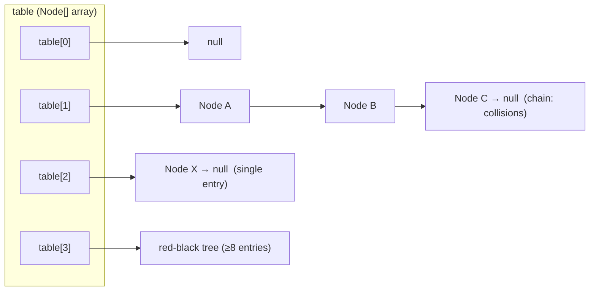

## TL;DR ⚡

> [!abstract] 5-second recall
>
> - HashMap = an **array of buckets**; each bucket is one array slot holding a **singly-linked list** (or a **red-black tree** when ≥8 entries).
> - **put:** `hash = h ^ (h>>>16)` → `index = (n-1) & hash` → insert in that bucket's chain.
> - **get:** same hash/index → walk that one bucket, match with `hash==` then `equals()`.
> - **Hook:** _hashCode finds the bucket; equals finds the entry._
> - Load factor **0.75** → resize (double) when 75% full. Override equals ⇒ **must** override hashCode.

## Structure (diagram)



- A **bucket** = one array slot (one index). A size-16 map = **16 buckets** = array length 16.
- Each bucket holds null, a **singly-linked** chain (`Node.next` only), or a **red-black tree**.
- `LinkedHashMap` uses a **doubly**-linked list (before/after) to keep insertion order — that's the version with `prev` pointers.

## put(key, value) — step by step

1. `h = key.hashCode()` (default = identity-ish; overridden for String/Integer/your class).
2. **Spread:** `hash = h ^ (h >>> 16)` (mixes high bits into low, since indexing only uses low bits).
3. **Index:** `index = (n - 1) & hash` (n is a power of 2, so this = fast modulo).
4. Go to `table[index]`; if empty, place the node. If not, walk the chain:
   - if a node's key matches (`hash==` then `equals`) → **replace** its value;
   - else append a new node.
5. If a bucket's chain reaches **8** nodes AND table ≥ **64** → **treeify** that bucket (list → red-black tree). (Below 64, it resizes instead.)
6. If size > capacity × 0.75 → **resize** (double the array, rehash entries).

## get(key) — step by step

```java
Node node = table[(n-1) & hash];   // O(1) jump to the bucket — no array scan
while (node != null) {
    if (node.hash == hash && (node.key == key || key.equals(node.key)))
        return node.value;
    node = node.next;              // walk THIS bucket's chain
}
return null;
```

- No loop over the array — you index straight to the bucket.
- **Why equals, not just hashCode?** A bucket holds multiple keys (collisions). hashCode found the _bucket_; `equals` finds the exact _key_ among the candidates.
- `hash ==` is checked first (cheap int compare); `equals()` only if hashes match (equals may be slow).
- `key == node.key` = reference identity (same object) — a fast shortcut before `equals`.

## The equals / hashCode contract (THE interview point)

Override `equals()` ⇒ you **must** override `hashCode()`. Why, mechanically:

- If two keys are `equals` but have **different** hashCodes → they compute **different indexes** → land in **different buckets** → `get()` looks in the wrong bucket and **never finds** the entry. The map silently "loses" your key.

## Clarified confusions

- **Bucket** = one array slot (index), not the whole array. 16 buckets = array of 16.
- **Same index, not same hash:** keys in one bucket usually have _different_ hashCodes that share low bits. e.g. size 16, index 3: hashCodes 3, 19, 35, 51 all end `0011` → all index 3.
- **`==` on objects** = reference/identity comparison (same object in memory), NOT "primitives only." Use `equals()` for logical equality.
- **Array holds list AND tree via inheritance:** `TreeNode extends Node`, so a `Node[]` slot can point to either; HashMap checks `instanceof TreeNode`. (Not generics.)

## Why 31 in hashCode

- `result = 31 * result + fieldHash` per field (this is what `Objects.hash(...)` does).
- **Odd** — an even multiplier (like 32) shifts bits left and throws away the top bit each step → information loss → collisions.
- **Prime** — shares no factors with data regularities → spreads values evenly.
- **Cheap** — `31 * i == (i << 5) - i` = `i*32 - i`. A shift + subtract (both ~1 cycle) instead of a multiply.

> [!note] Eureka aside (fixed-width ints)
> Same fixed 32-bit width explains BOTH: bits overflow the top on multiply, AND the range is bounded. But `max = 2³¹−1` vs `min = −2³¹` specifically because, in two's complement, **zero occupies a positive slot** — so the positive side loses one.

## Red-black tree (gist)

Self-balancing binary search tree. Colors nodes red/black and rebalances on insert/delete to guarantee **O(log n)** (never a long line). Used in DB indexes, `TreeMap`, Linux scheduler, HashMap treeify. Chosen over AVL for fewer rotations on writes.

## Map family

| Type | Order | Backing | Note |
|---|---|---|---|
| HashMap | none | array + singly-linked / tree | O(1) avg |
| LinkedHashMap | insertion (or access) | + doubly-linked list | predictable iteration |
| TreeMap | sorted by key | red-black tree | O(log n), needs Comparable/Comparator |

> Map is **not** part of the Collection interface — it stores key-value _pairs_, not single elements (but its views — keySet/values/entrySet — are Collections).

## Simplified implementation (real-ish, with driver)

> No treeify (kept as a linked list) for clarity. `key.hash` was a bug in an
> earlier draft — the condition compares `node.hash` (cached) with the **local**
> computed `hash`, never a non-existent `key.hash`.

```java
public class SimpleHashMap<K, V> {

    // A bucket node. In the real JDK, Node implements Map.Entry<K,V>.
    static class Node<K, V> {
        final int hash;        // cached spread-hash of THIS node's key.
                               // 'final' = set once in the constructor, never changes
                               // (a key's hash never changes → compute once, cache forever).
        final K key;
        V value;
        Node<K, V> next;       // next node in the SAME bucket (the collision chain)

        Node(int hash, K key, V value, Node<K, V> next) {
            this.hash = hash;  // <-- 'final int hash' is populated HERE, at put() time
            this.key = key;
            this.value = value;
            this.next = next;
        }
    }

    private Node<K, V>[] table;   // the array of buckets
    private int size;             // number of entries stored
    private static final int DEFAULT_CAPACITY = 16;
    private static final float LOAD_FACTOR = 0.75f;

    @SuppressWarnings("unchecked")
    public SimpleHashMap() {
        // Java forbids generic array creation: `new Node<K,V>[16]` won't compile
        // (arrays are reified, generics erased). So make a raw array and cast it.
        table = (Node<K, V>[]) new Node[DEFAULT_CAPACITY];
    }

    // HashMap's INTERNAL spread — mixes high bits into low bits, because indexing
    // uses only the low bits via & (n-1). This is separate from key.hashCode():
    // the key computes hashCode(); the MAP does this spreading afterwards.
    private int hash(K key) {
        if (key == null) return 0;
        int h = key.hashCode();
        return h ^ (h >>> 16);
    }

    private int indexFor(int hash, int n) {
        return (n - 1) & hash;   // n is a power of 2 → fast modulo
    }

    public void put(K key, V value) {
        int hash = hash(key);                     // local computed (spread) hash
        int idx  = indexFor(hash, table.length);
        Node<K, V> head = table[idx];             // CURRENT content of this bucket:
                                                  // null if empty, else the head of a
                                                  // chain placed by earlier put() calls.

        // Walk the existing chain; if the key is already here, replace its value.
        for (Node<K, V> n = head; n != null; n = n.next) {   // n = n.next → walks the chain
            if (n.hash == hash                               // compare CACHED hash vs computed hash
                && (n.key == key || (key != null && key.equals(n.key)))) {
                n.value = value;                             // key found → update, done
                return;
            }
        }
        // Key absent → prepend a new node (its 'next' points at the old head).
        table[idx] = new Node<>(hash, key, value, head);
        if (++size > table.length * LOAD_FACTOR) resize();   // grow past 75% full
    }

    public V get(K key) {
        int hash = hash(key);
        int idx  = indexFor(hash, table.length);
        // Jump straight to the bucket (O(1)) — no scan of the whole array.
        for (Node<K, V> n = table[idx]; n != null; n = n.next) {  // n = n.next → chain walk
            if (n.hash == hash
                && (n.key == key || (key != null && key.equals(n.key)))) {
                return n.value;
            }
        }
        return null;   // not found in this bucket
    }

    @SuppressWarnings("unchecked")
    private void resize() {
        Node<K, V>[] old = table;
        int oldCap = old.length;
        table = (Node<K, V>[]) new Node[oldCap * 2];   // double capacity (cast: same reason as above)
        size  = 0;
        // SIMPLE version: re-insert everything (clear + re-put). Easy to read.
        // The REAL JDK 8 uses the smarter split below — no rehashing.
        for (Node<K, V> head : old)
            for (Node<K, V> n = head; n != null; n = n.next)
                put(n.key, n.value);
    }

    public int size() { return size; }

    // ---------------- driver ----------------
    public static void main(String[] args) {
        SimpleHashMap<String, Integer> m = new SimpleHashMap<>();
        m.put("alice", 1);
        m.put("bob", 2);
        m.put("alice", 99);                       // replaces, NOT a new entry
        System.out.println(m.get("alice"));       // 99
        System.out.println(m.get("bob"));         // 2
        System.out.println(m.get("carol"));       // null
        System.out.println("size = " + m.size()); // 2

        for (int i = 0; i < 20; i++) m.put("k" + i, i);  // force resize past 0.75 * 16
        System.out.println("k17 = " + m.get("k17"));      // 17 (survived the resize)
    }
}
```

### The REAL resize (JDK 8 split) — your "old index + old size" question

You (and the article) were right: the JDK does **not** rehash from scratch. When
capacity doubles (`n → 2n`), `index = hash & (n-1)` gains exactly **one more bit**.
Test that one bit with `hash & oldCap`:

- bit **0** → entry stays at the **same index** `j`
- bit **1** → entry moves to `j + oldCap`

So each old bucket splits into two chains — a **lo** list (stays at `j`) and a
**hi** list (moves to `j + oldCap`) — in one pass, no `hashCode` recompute:

```java
// for each old bucket j, split its chain into lo/hi by one bit:
Node lo = null, hi = null;                 // (heads; JDK keeps tails to preserve order)
for (Node n = old[j]; n != null; n = n.next) {
    if ((n.hash & oldCap) == 0)  lo = link(lo, n);   // stays at index j
    else                          hi = link(hi, n);  // goes to index j + oldCap
}
newTable[j]          = lo;
newTable[j + oldCap] = hi;
```

That's the `oldIndex` / `oldIndex + oldCap` optimization your article described.
(JDK 8+ preserves relative order in the split; JDK 7 reversed it and could infinite-loop under concurrency — a famous bug.)

## Q\&A / reasoning (from drilling — the "why")

> [!question]- Where does `node.hash` get its value, and why is it `final`?
> In `put`: `int hash = hash(key)` → passed to `new Node<>(hash, ...)` → the
> constructor does `this.hash = hash`. So `node.hash` is **the key's spread hash,
> cached at insert time**. `final` = set once, never changes (a key's hash never
> changes), so `get` never recomputes it — an optimization.

> [!question]- Why `node.hash == hash` and not `node.key.hash` or `key.hash`?
> The node caches its key's hash in `node.hash`, so you read that directly. `key`
> is the lookup parameter of type `K` — it has **no `.hash` field**; you compare
> against the **local computed** `hash`. (`key.hash` was a bug in an early draft.)

> [!question]- How can a Node's hash equal a key's hash — they're different types?
> `node.hash` _is_ the hash of the node's key. So you're comparing two **key**
> hashes (lookup key vs stored key), not "node vs key."

> [!question]- Is a bucket the array, or a slot?
> A **slot** (one index). Size-16 map = 16 buckets = array length 16. Each bucket
> holds null, a linked list, or a tree.

> [!question]- Same hash or same index in a bucket?
> Same **index**. Collided keys usually have _different_ hashCodes that share low
> bits (e.g. size 16, index 3: hashes 3, 19, 35, 51 all end `0011`).

> [!question]- `==` vs `equals` on the key?
> `==` = reference identity (same object) — a fast shortcut. `equals` = logical
> equality. `==` works on objects too (comparing references), not just primitives.

> [!question]- How does one `Node[]` array hold both a linked list and a tree?
> `TreeNode extends Node`, so a `Node[]` slot can point to either; HashMap checks
> `instanceof TreeNode`. Polymorphism, not generics.

> [!question]- Why the cast `(Node<K,V>[]) new Node[n]` in resize?
> Java forbids generic array creation (`new Node<K,V>[n]` won't compile — reified
> arrays vs erased generics). Make a raw array and cast (unchecked warning).

> [!question]- Couldn't resize reuse `oldIndex` / `oldIndex + oldCap` instead of rehashing?
> Yes — that's the real JDK 8 optimization. Doubling capacity adds one significant
> bit; `hash & oldCap` decides: 0 → stay at `j`, 1 → move to `j + oldCap`. Each
> bucket splits into lo/hi lists in one pass, no hashCode recompute.

## References

- How hashCode is computed (Imran Khan, Medium) — https://medium.com/@imrankhan7581/how-hash-code-is-computed-working-244e66db343a
- Video: "Garbage collection / HashMap internals" (threads-as-arrows creator) — https://www.youtube.com/watch?v=UnaNQgzw4zY
- Official: `java.util.HashMap` Javadoc — https://docs.oracle.com/en/java/javase/21/docs/api/java.base/java/util/HashMap.html

## Test Yourself

What is a bucket?::One slot of the table array (one index). A size-16 map has 16 buckets; each holds null, a linked list, or a tree.
put steps?::hashCode → spread (h ^ h>>>16) → index (n-1)\&hash → walk bucket: replace if key matches (hash== then equals) else append → treeify at 8 (table≥64) → resize at 0.75.
Why does get need equals, not just hashCode?::hashCode only finds the bucket; a bucket holds multiple colliding keys, so equals finds the exact one.
Why must you override hashCode if you override equals?::Equal keys with different hashCodes go to different buckets → get looks in the wrong bucket and never finds the entry.
Why 31 in hashCode?::Odd (no bit loss like even 32), prime (spreads values), and cheap: 31\*i == (i<<5)-i (shift + subtract).
How does one array hold both a list and a tree?::TreeNode extends Node, so a Node\[] slot can point to either; HashMap checks instanceof TreeNode. Polymorphism, not generics.
==&#x20;vs equals on objects?::== compares references (same object in memory); equals compares logical equality. == is not "primitives only."
